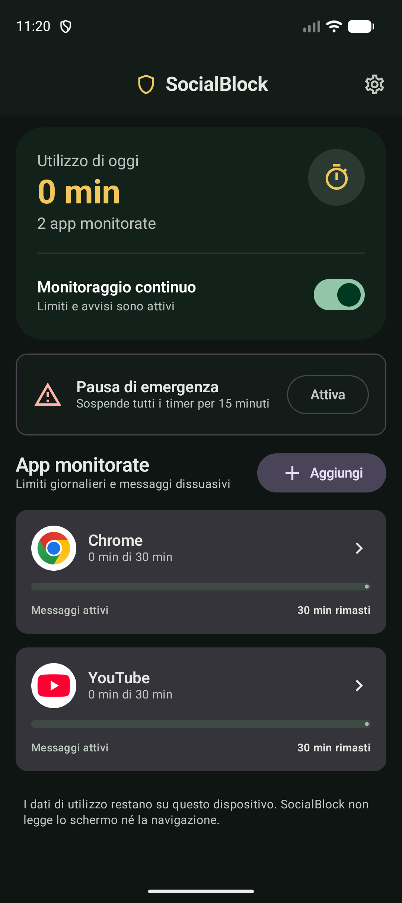
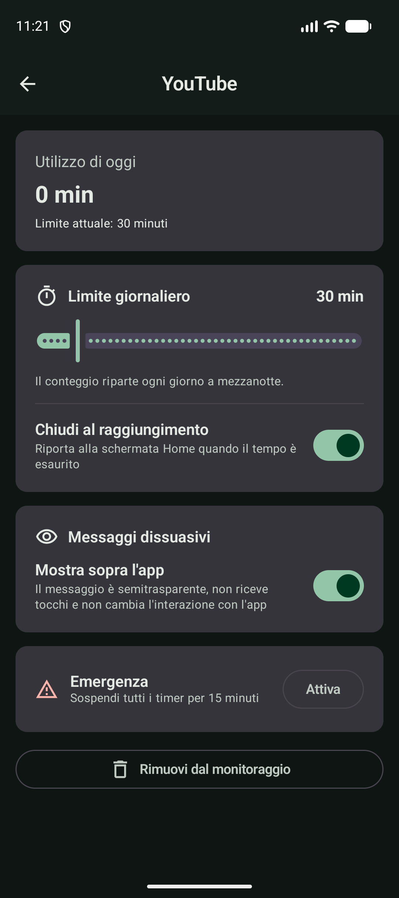
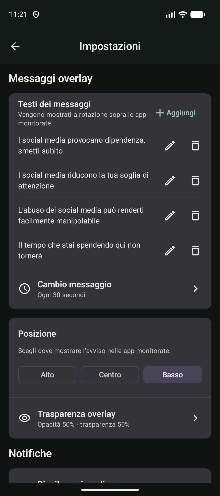

# SocialBlock

**SocialBlock** is a privacy-first Android app that helps you spend less time on social media.
Pick the apps you want to keep in check, give each one a daily time limit, and SocialBlock will
remind you while you use them — with warning messages inspired by the labels on cigarette packs —
and send you back to the Home screen when your time is up.

Everything runs on your device: no account, no network access, no screen reading.

[](LICENSE)

<p align="center">
  
</p>

## Features

- **Per-app daily limits** – choose any installed app and set its daily budget. Usage is measured
  with Android's `UsageStatsManager` and resets automatically at local midnight.
- **Automatic close at the limit** – when the time runs out, SocialBlock returns you to the Home
  screen, and does it again if you reopen the app.
- **Warning overlay messages** – rotating messages in the style of cigarette-pack warnings, e.g.
  - *"I social media provocano dipendenza, smetti subito"*
  - *"I social media riducono la tua soglia di attenzione"*
  - *"L'abuso dei social media può renderti facilmente manipolabile"*

  The overlay is semi-transparent and **touch-through**: it never takes focus or intercepts
  touches, so the app underneath works exactly as usual. You can edit the messages and change how
  often they rotate, the overlay's opacity, and its position (top, center, bottom).
- **Emergency pause** – one tap (in the app or straight from the ongoing notification) suspends
  every timer for 15 minutes, for when you really need that app.
- **Notifications**
  - 5 minutes before a limit is reached
  - when a limit is reached
  - when the emergency pause is turned on
  - a daily usage summary at a time you choose (22:00 by default)
- **Privacy by design** – usage data stays in a local Room database and DataStore, excluded from
  cloud backup and device transfer. SocialBlock does not use an Accessibility Service, does not read
  screen contents or browsing data, and does not request the `INTERNET` permission.
- **Battery friendly** – usage events are processed incrementally, with adaptive polling that
  speeds up only while a tracked app is in the foreground.

## Screenshots

| Dashboard | App limit | Settings | Overlay on YouTube |
|:---:|:---:|:---:|:---:|
|  |  |  |  |

> The user interface is currently in Italian.

## Permissions

SocialBlock asks for each permission only when it's needed, and explains why on the dashboard:

| Permission | Why |
|---|---|
| Usage access (`PACKAGE_USAGE_STATS`) | Measure time spent in the apps you selected |
| Display over other apps (`SYSTEM_ALERT_WINDOW`) | Show the touch-through warning overlay |
| Notifications (`POST_NOTIFICATIONS`) | Limit alerts, the daily summary and the emergency action |
| Foreground service, boot completed | Keep monitoring running and restore it after a reboot |

> Android doesn't let regular apps force-stop other apps, so SocialBlock enforces limits by
> sending you to the Home screen using public platform APIs.

## Tech stack

- **Kotlin**, **Jetpack Compose** with **Material 3**
- **MVVM** with unidirectional data flow, **Navigation Compose**
- **Hilt** for dependency injection
- **Room** (usage data) and **DataStore** (preferences)
- **Coroutines** and **Flow**, **WorkManager** for the daily summary
- `UsageStatsManager` for usage tracking and `WindowManager` for the overlay
- Tests: **JUnit**, **MockK**, **Turbine**, Compose UI tests
- Static analysis: **Android Lint**, **ktlint**, **detekt**

## Project structure

```
app/src/main/java/it/socialblock/
├── data/           Room entities/DAOs, repositories, DataStore settings
├── domain/         Models, limit evaluation, monitoring policies (pure Kotlin)
├── usage/          Usage-event collection and incremental aggregation
├── monitoring/     Foreground service, overlay, limit enforcement, boot + emergency receivers
├── notifications/  Notification channels and notifier
├── work/           WorkManager daily summary
├── platform/       Android wrappers (installed apps, permissions, time, formatting)
└── ui/             Compose screens, ViewModel, theme
```

## Building

Requirements: JDK 17 or newer and the Android SDK (compile SDK 36). The minimum supported
Android version is 8.0 (API 26).

```bash
git clone https://github.com/GoodTimes14/socialblock.git
cd socialblock
./gradlew assembleDebug
```

The debug APK is written to `app/build/outputs/apk/debug/app-debug.apk`. Install it with
`adb install app/build/outputs/apk/debug/app-debug.apk`, or open the project in Android Studio.

### Tests and checks

```bash
./gradlew test                        # unit tests
./gradlew lint                        # Android Lint
./gradlew ktlintCheck detekt          # code style and static analysis
./gradlew connectedDebugAndroidTest   # instrumented tests (emulator or device required)
```

## Getting started

1. Open SocialBlock and grant **usage access** from the dashboard.
2. Tap **Aggiungi** and choose an app to monitor (for example YouTube or Instagram).
3. Set the daily limit and turn on warning messages from the app's page.
4. Grant **display over other apps** and **notifications** to enable the overlay and alerts.
5. Customize messages, overlay position/opacity and the daily-summary time in **Impostazioni**.

## License

Copyright (C) 2026 Raniero Martufi (GoodTimes14)

SocialBlock is free software: you can redistribute it and/or modify it under the terms of the
[GNU General Public License v3.0](LICENSE) as published by the Free Software Foundation, either
version 3 of the License, or (at your option) any later version.

SocialBlock is distributed in the hope that it will be useful, but WITHOUT ANY WARRANTY; without
even the implied warranty of MERCHANTABILITY or FITNESS FOR A PARTICULAR PURPOSE. See the
[LICENSE](LICENSE) file for details.
